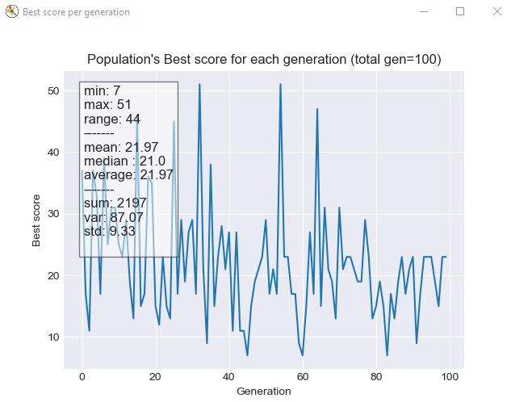

# Quest AI :earth_africa:

A medium project where little things evolve in a simulated and simplified world, while trying to survive, as long as possible, world climate changes.


## Dependencies :package:
Note that following libraries are used in the project, thus are required on your machine if you want to run it :
   ```
   numpy
   tkinter
   matplotlib
   pyyaml
   ```

## quick start :rocket:

1. Install all dependencies
1. Then run :
   ```
   python3 main.py
   ```

## :building_construction: world building :seedling:

Rain :cloud_with_rain: occures randomly on small part of the map and provide a natural world's water supply.

## Data Model :books:


## AI types :robot:

As for entities, we have implemented the following ones :

1. A __Random entity__ that acts regardless of his environment changes.
1. A __Water seeker AI__ that can choose only between `wait`, `move` or `drink`.
1. An __Herbivorous AI__ that can, not only choose between `wait`, `move` and `drink` actions, but also `eat` available food. 
1. A __Carnivorous AI__ which have same options as __Herbivorous AI__, but can also eat other "species".
1. A __Cannibal AI__, the most dangerous one, can devour everything near it.

## Display :sparkles:
An example of Neural Network viewed from the console log :
```
$ py back/ai/network.py
   [Input]             Input Weights           [Hidden 1]   Hidden Weights   [Hidden 2]   Output Weights    [Output]
      0        -0.701  0.321   -0.904  -0.437       0        -0.689  -0.186       0        0.336    0.46        0
      0        0.468    -0.1   -0.654  -0.132       0        0.149   -0.006       0        0.416   0.118        0
      0                                                                                    0.487   -0.192       0
      0
                                                ----- mutation -----

   [Input]             Input Weights           [Hidden 1]   Hidden Weights   [Hidden 2]   Output Weights    [Output]
      0        -0.785  0.321     -1    -0.267       0        -0.504  -0.186       0        0.336   0.651        0
      0        0.468   -0.214  -0.902  0.075        0        0.149   -0.006       0         0.49    0.28        0
      0                                                                                    0.487    0.14        0
      0

```



